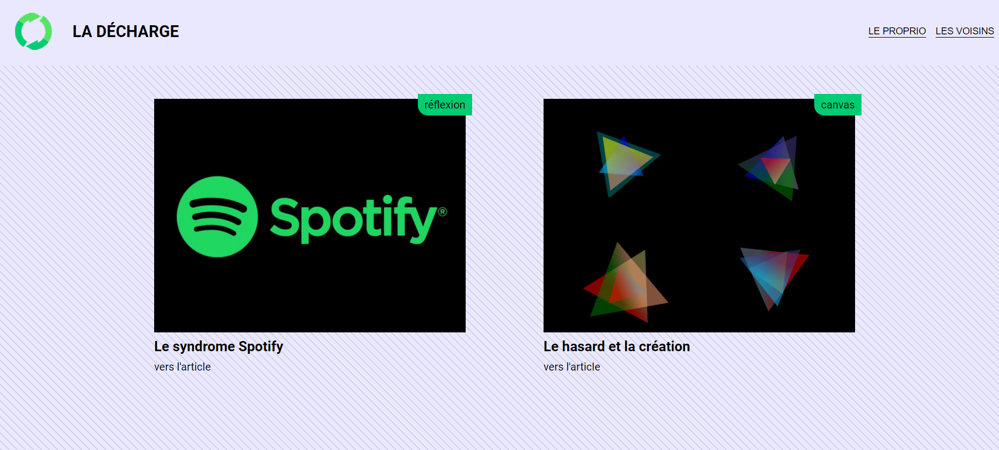
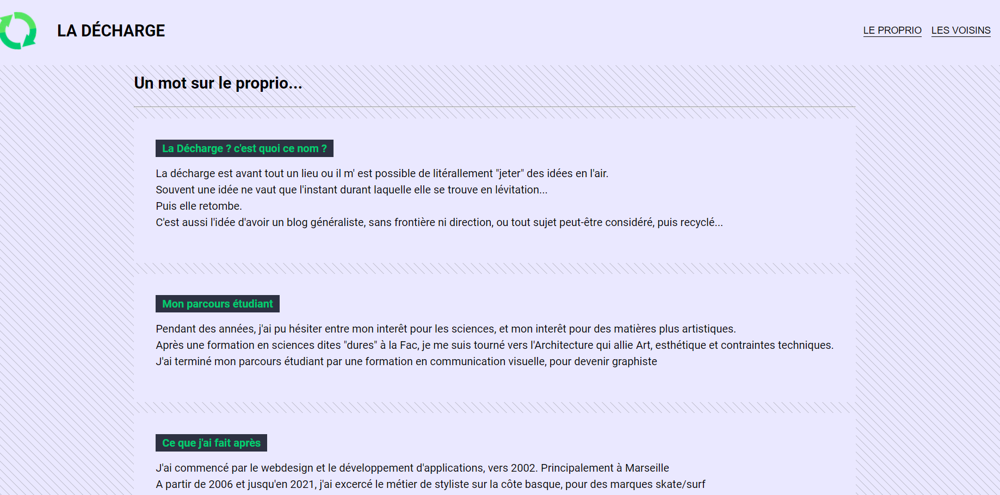

# Blog personnel sur un peu tout #
- lien : https://la-decharge.vercel.app/
### Technologies utilisées ###
- Next.js
- Contentful
- Vercel pour le déploiement
### Contenu ###
La décharge est avant tout un lieu ou il m' est possible de litérallement "jeter" des idées en l'air.
Souvent une idée ne vaut que l'instant durant laquelle elle se trouve en lévitation...
Puis elle retombe.
C'est aussi l'idée d'avoir un blog généraliste, sans frontière ni direction, ou tout sujet peut-être considéré, puis recyclé...

